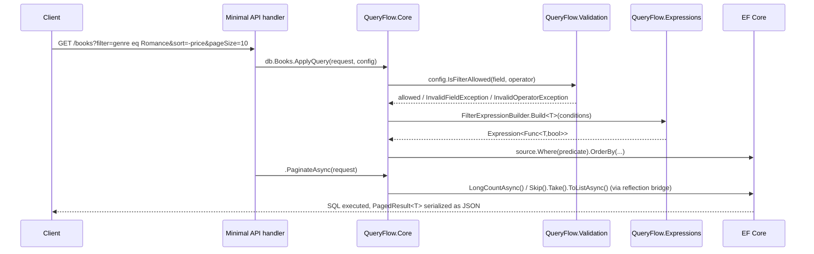

# Architecture Overview

## Design goals

- **ORM-independent core.** The bulk of the logic — expression building, validation, cursor codec — has no dependency on EF Core, Dapper, or ASP.NET Core. Provider-specific packages are thin adapters on top.
- **Security is structural, not incidental.** Every field name and operator passes through `QueryableConfig<T>` before it can influence an expression tree or SQL string. There's no code path that splices a raw client string into a query.
- **Cheap by construction.** Reflection (property path resolution, generic `MethodInfo` construction for `OrderBy`/`Select`/`Sum`/etc.) is cached process-wide. Expression trees are rebuilt per call (cheap — just object graph construction) rather than compiled, so they stay translatable by LINQ providers.

## Package graph

```mermaid
graph TD
    Abstractions[QueryFlow.Abstractions<br/><i>models, enums, exceptions, options — no deps</i>]
    Expressions[QueryFlow.Expressions<br/><i>expression-tree builders, reflection caching</i>]
    Validation[QueryFlow.Validation<br/><i>QueryableConfig allowlist, request validator</i>]
    Core[QueryFlow.Core<br/><i>Filter/Search/Sort/SelectFields/Paginate/Aggregate</i>]
    EFCore[QueryFlow.EFCore<br/><i>Include(), ApplyQuery()</i>]
    Dapper[QueryFlow.Dapper<br/><i>DapperQueryBuilder&lt;T&gt;</i>]
    AspNetCore[QueryFlow.AspNetCore<br/><i>query-string DSL, DI, middleware</i>]
    OpenApi[QueryFlow.OpenApi<br/><i>Swashbuckle operation filter</i>]

    Expressions --> Abstractions
    Validation --> Abstractions
    Core --> Abstractions
    Core --> Expressions
    Core --> Validation
    EFCore --> Core
    Dapper --> Abstractions
    Dapper --> Validation
    AspNetCore --> Core
    OpenApi --> AspNetCore
```

Note `QueryFlow.Dapper` does **not** depend on `QueryFlow.Expressions` — Dapper has no `IQueryable`/LINQ surface, so it builds parameterized SQL text directly instead of expression trees.

## Request lifecycle (EF Core path)



## Key internal mechanisms

### Reflection caching (`QueryFlow.Expressions.Caching`)

- `PropertyPathCache` resolves dotted field paths (`"Address.City"`) to `PropertyInfo[]` chains once per (type, path) and caches them.
- `ReflectionMethodCache` pre-resolves and caches closed generic `MethodInfo` for `OrderBy`/`ThenBy`/`Select`/`Contains`, avoiding repeated `MakeGenericMethod` calls.

### Field selection without a hard-coded DTO

`FieldSelectionExpressionBuilder` uses `System.Reflection.Emit` (`DynamicTypeBuilder`) to generate a small class with one property per requested field, cached by field-set signature. Projecting onto this real CLR type — rather than a `Dictionary<string, object>` — lets EF Core translate the projection into a `SELECT` that only touches the requested columns. Materialized instances are converted to a plain dictionary afterward for uniform JSON output.

### Cursor pagination (keyset, not offset)

`CursorSeekExpressionBuilder` builds the standard "seek method" predicate — `(k1 > v1) OR (k1 = v1 AND k2 > v2) OR ...` — from the active sort fields and the last row's key values. `QueryFlow.Core.Cursor.CursorCodec` serializes those key values, HMAC-SHA256 signs them, and base64url-encodes the result into the opaque cursor token. Paging backward flips both the comparison operators and the final sort order, then reverses the materialized page back to natural order.

### ORM-independent async (`EfCoreAsyncBridge`, `AggregateBridge`)

`QueryFlow.Core` doesn't reference EF Core, but it still wants real async I/O when the underlying source happens to be an EF Core query. `EfCoreAsyncBridge` locates `EntityFrameworkQueryableExtensions.ToListAsync`/`CountAsync`/etc. via reflection *once* (checking whether the EF Core assembly is loaded at all) and invokes them directly if present — genuine async ADO.NET, not a thread-pool hop — falling back to synchronous LINQ wrapped in `Task.Run` when EF Core isn't in the picture (e.g. Dapper-materialized `List<T>`, LINQ-to-Objects).

### Validation as a single choke point

`QueryRequestValidator.Validate` and the per-capability checks on `QueryableConfig<T>` (`IsFilterAllowed`, `IsSortAllowed`, `IsSelectAllowed`, `IsIncludeAllowed`) are the only places a client-supplied field name or operator is accepted. Everything downstream — `FilterExpressionBuilder`, `DapperQueryBuilder<T>` — assumes it has already been validated and will throw the same way if called directly with an unchecked value, so there's no way to bypass validation by calling a lower-level API.

## Why not System.Linq.Dynamic.Core?

Dynamic LINQ string parsing (`"Age > 18"` as a raw expression string) is powerful but makes the injection-prevention story about *string sanitization* — is this expression string safe to evaluate? QueryFlow instead represents queries as structured data (`FilterCondition`, `SortField`, ...) from the start, so validation is a matter of checking discrete field/operator pairs against an allowlist, not parsing and sandboxing an expression language.
